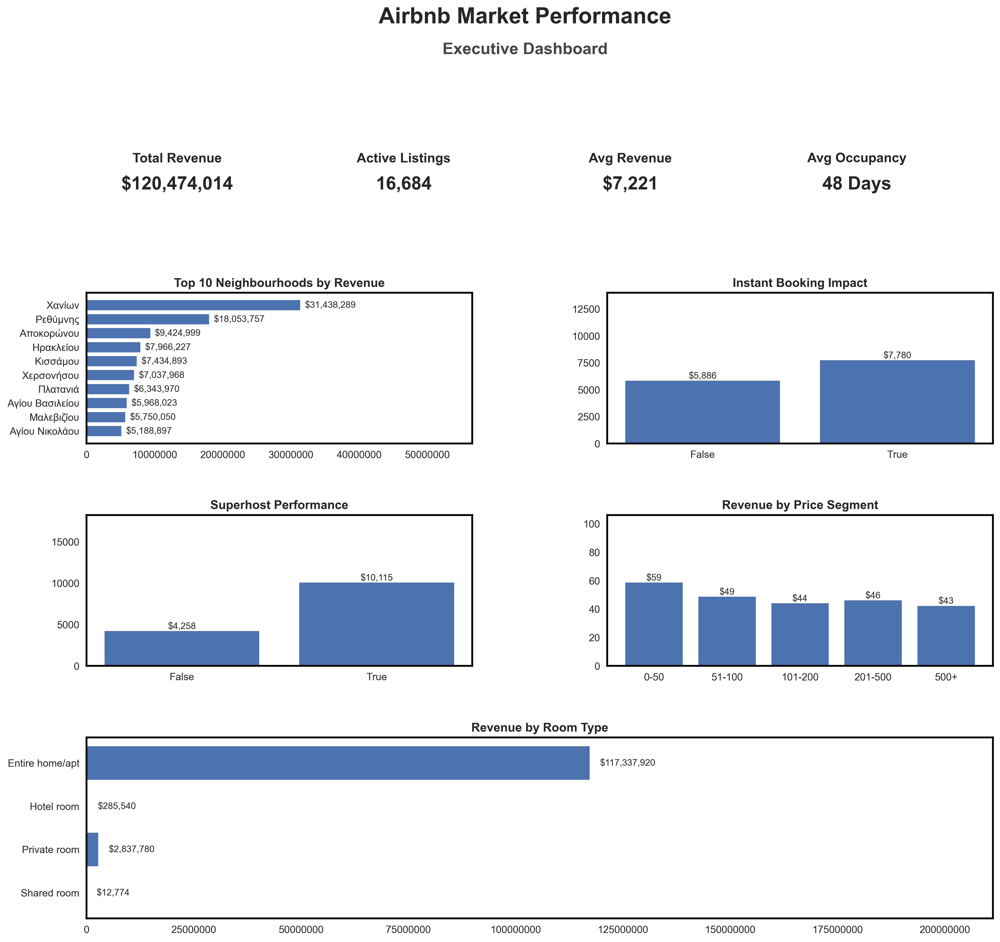
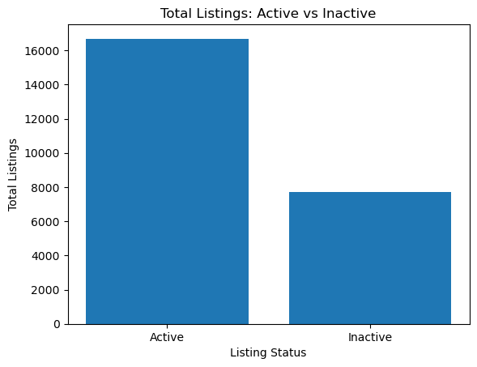
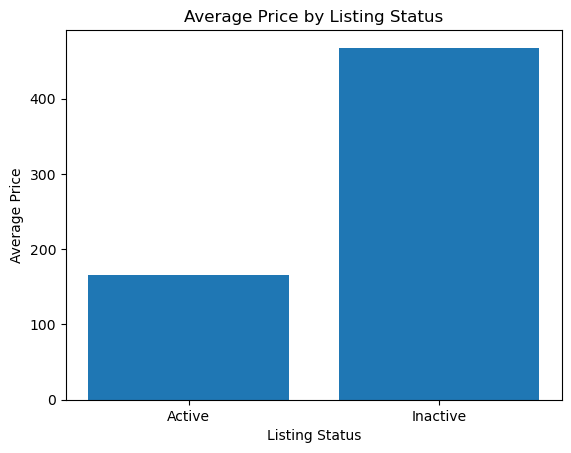
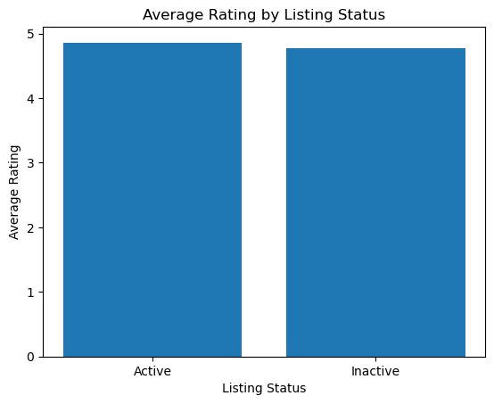
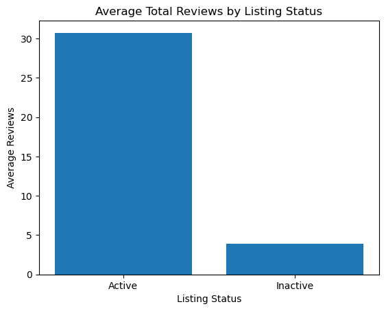

# 🏡 Airbnb Market Performance Analysis

End to End Data Analytics Project (Python + PostgreSQL + SQL + Matplotlib)

## 📌 Project Overview

This project explores Airbnb listing performance using an end to end analytics workflow from raw data cleaning to business insights and visualization.

The goal was not just to run queries, but to simulate how a real data analyst would:

  - Clean and prepare raw data

  - Design a structured SQL database

  - Execute advanced analytical queries

  - Visualize findings

  - Translate results into business insights and recommendations

The analysis focuses on pricing behavior, revenue drivers, host performance, occupancy patterns, and competitive positioning.

## 🛠 Tools & Technologies

  - Python (Pandas, Matplotlib)

  - PostgreSQL

  - SQLAlchemy

  - Advanced SQL (CASE, Aggregations, Window Functions)

  - VS Code / Jupyter Notebook

## 🔄 Project Workflow

1️⃣ Data Cleaning & Preparation (Python)

  - Handled missing values and inconsistencies

  - Corrected data types (floats → integers where appropriate)

  - Cleaned percentage columns (e.g., host response rate)

  - Rounded numeric fields to appropriate precision

  - Engineered new metrics such as occupancy rate

  - Validated calculated revenue columns

  - Exported cleaned dataset for database import

2️⃣ Database Design (PostgreSQL)

  - Created structured table schema with appropriate data types

  - Managed encoding and import errors

  - Resolved numeric precision issues

  - Handled duplicate key conflicts

  - Added indexes to improve query performance

  - Structured data for scalable querying

3️⃣ Advanced SQL Analysis

Ten business focused analytical questions were explored, including:

  - Revenue concentration by neighbourhood

  - Instant Booking performance impact

  - Superhost vs Non-Superhost comparison

  - Price segmentation analysis

  - Room type revenue comparison

  - Correlation between price and ratings

  - Top-performing hosts by revenue

  - Availability strategy impact

  - Overpriced neighbourhood detection

  - Revenue ranking within neighbourhood (Window Function)

Segmentation logic was implemented using CASE statements to classify:

  - Active vs Inactive listings

  - Price bands

  - Availability groups

Window functions were used to rank listings within neighbourhoods to evaluate competitive positioning.

## 📊 Visualization

Five key analyses were visualized using Matplotlib to support executive style storytelling:

  - Top 10 Neighbourhoods by Active Revenue

  - Instant Booking vs Non Instant Revenue

  - Superhost vs Non Superhost Performance

  - Revenue by Price Segment

  - Total Revenue by Room Type

  ## 📊 Executive Summary Dashboard

Visuals were structured for clarity, sorted for readability, and formatted for presentation-level quality.

## 🔍 Active vs Inactive Listing Analysis

To further understand market performance, listings were segmented into **Active** (recent occupancy or reviews) and **Inactive** listings.

This comparison highlights differences in pricing, ratings, and revenue generation.

### Total listing Comparison

### Average Price Comparison

### Average Rating Comparison

### Review Volume Comparison

## 🔍 Key Insights

  - Revenue is highly concentrated in specific neighbourhoods.

  - A small number of hosts dominate total revenue, indicating market concentration.

  - Superhost status and Instant Booking are associated with stronger revenue performance.

  - Mid-range price segments appear to balance demand and profitability most effectively.

  - Entire homes generate significantly higher revenue compared to shared or private rooms.

  - Pricing does not strongly correlate with review ratings.

  - Active listings significantly outperform inactive listings in engagement and revenue metrics.

  - Revenue distribution within neighbourhoods is uneven, with top listings capturing disproportionate share.

## 💡 Strategic Recommendations

  - Hosts should benchmark pricing within high performing market segments.

  - Enabling Instant Booking may improve occupancy and revenue performance.

  - Achieving Superhost status provides competitive advantage.

  - Underperforming listings should reassess pricing, availability, and presentation quality.

  - Market expansion strategies should focus on neighbourhoods with strong active revenue.

  - Calendar optimization can improve listing visibility and booking potential.

  ##  Airbnb-project/
│
├── data/
│   ├── raw/
│   │   └── crete_greece.csv.gz
│   └── processed/
│       └── airbnb_listings_sample.csv  # Output from data_cleaning.py
│
├── scripts/
│   └── data_cleaning.py         # Your cleaning code
│
├── notebooks/
│   └── airbnb_analysis.ipynb    # Cleaning code, SQL queries, visualizations, insights
│
├── sql/
│   └── airbnb_queries.sql       # Optional: just your SQL queries
│
└── README.md

##  Data Availability

  - Due to Github file size limitations, the complete cleaned dataset (37MB+) is not included in this repository.
  - A representative sample dataset is provided to demonstrate the analytical workflow.
  - The full dataset is available upon request. 

## 🧠 Skills Demonstrated

  - End to End Data Pipeline Development

  - Data Cleaning & Transformation

  - Feature Engineering

  - SQL Schema Design

  - Index Optimization

  - Advanced SQL Querying

  - Window Functions & Conditional Logic

  - Business Insight Generation

  - Data Visualization

  - Analytical Communication

## 🚀 What This Project Represents

This project demonstrates the ability to:

  - Move from raw dataset → structured database → insight-driven storytelling

  - Combine Python and SQL effectively

  - Translate technical analysis into business strategy

  - Communicate findings clearly and professionally

  - It reflects practical, real world analytical thinking beyond basic querying.